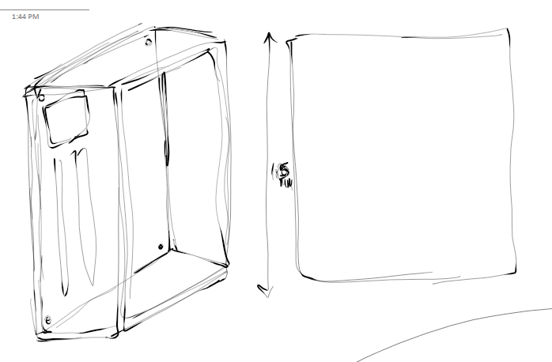
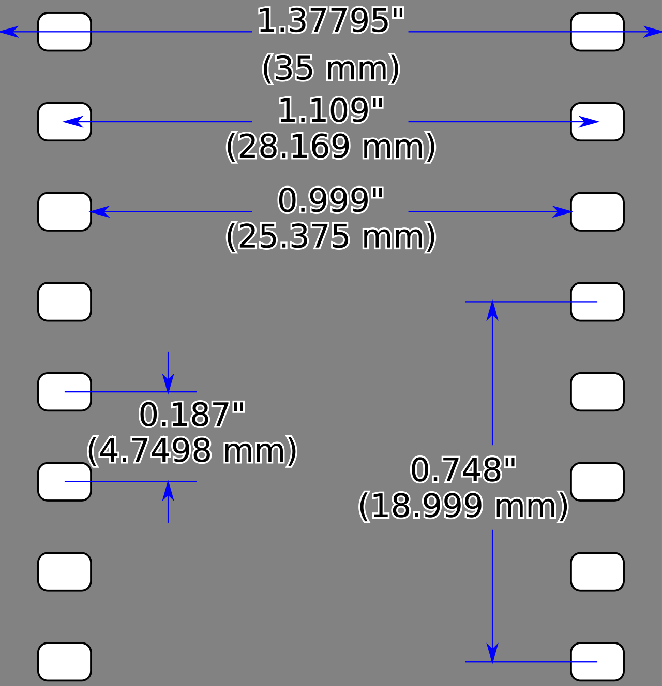
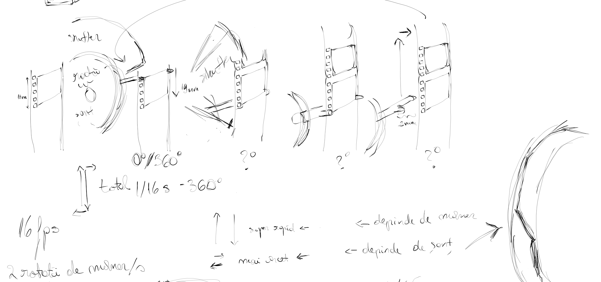
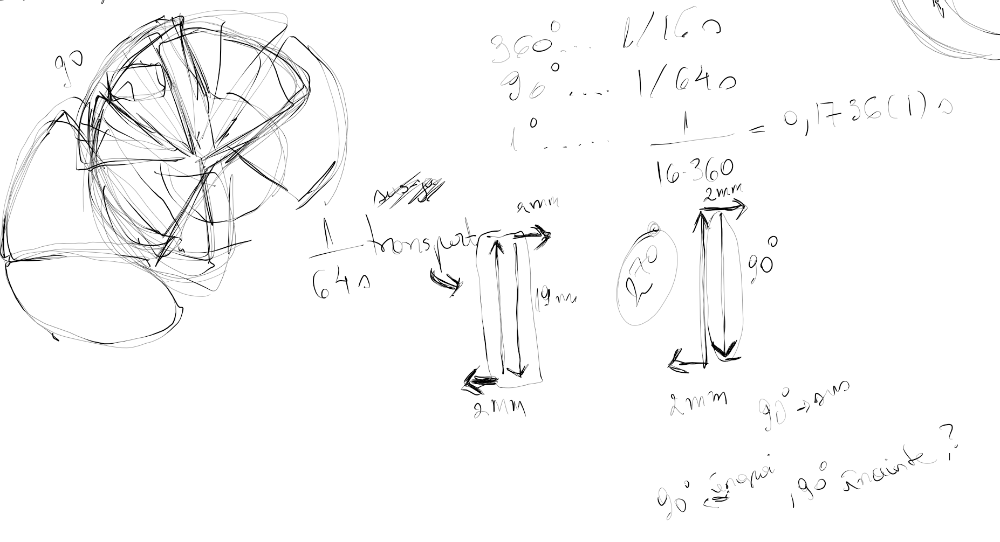
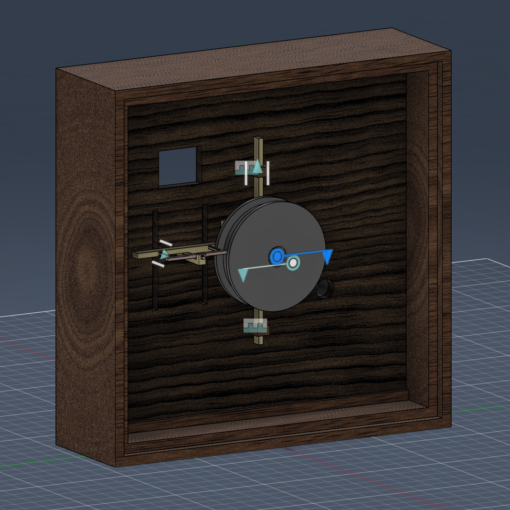
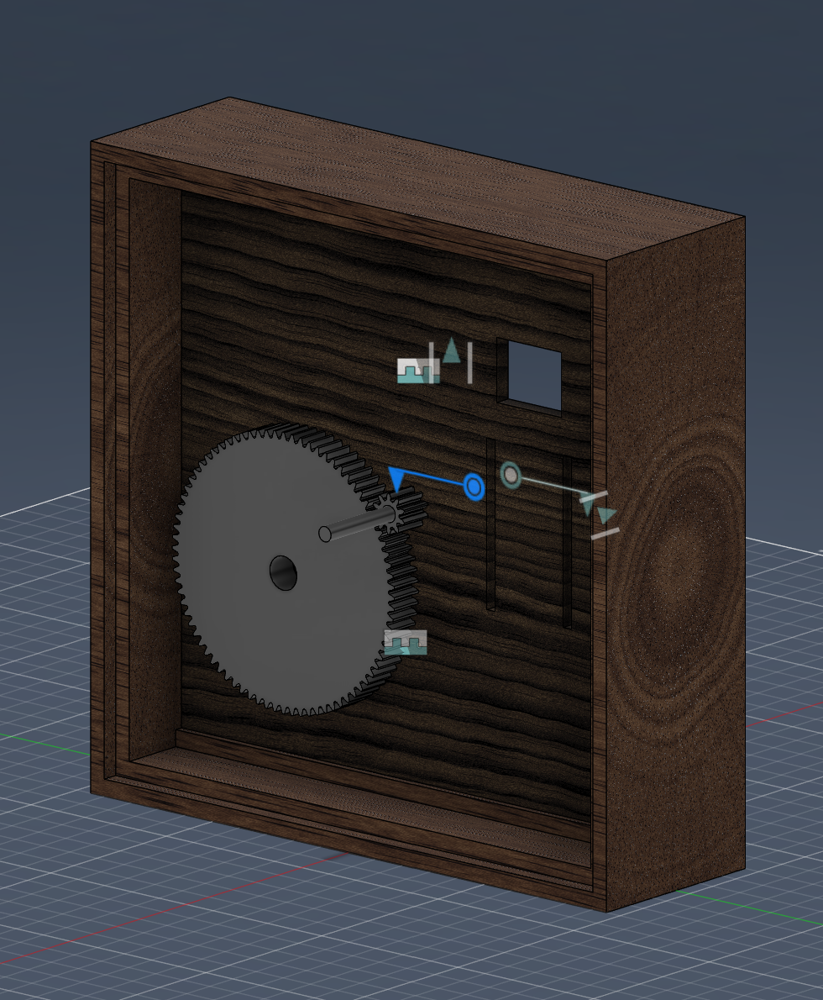
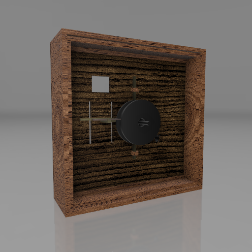
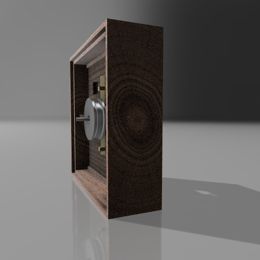
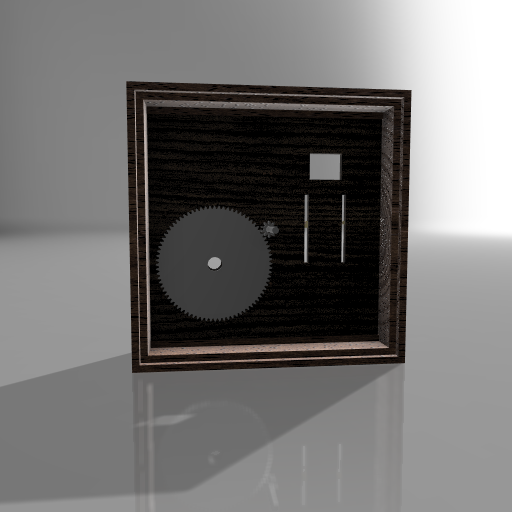

Acest
repo
a
fost
creat
pentru
a
documenta
proiectul
cursului
de
Printare
si
Modelare
3D

<h1>Cinematograf</h1>

În cadrul acestui proiect, voi modela un videoproiector pentru film   Acest mecanism constă într-o manetă ce rotește niște gears, transformând o rotație într-o oscilație verticală pentru a muta un cadru cu o furcă ce avansează filmul la o anumită viteză și un obturator.

<h2>Surse de inspirație</h2>
<a href="https://en.wikipedia.org/wiki/Cinematograph">Cinematograf Lumiere</a>

<h2>Principiul de funcționare al Cinematografului</h2>

Pentru a putea avansa filmul, totul pleacă de la o mișcare de rotație. Utilizatorul învărte de mâner, vom presupune că la o mișcare naturală acesta realizează în jur de 2 rotiri pe secundă. Pentru 16 cadre pe secundă avem nevoie de 16 rotiri pe secundă, așadar trebuie să multiplicăm input-ul de 8 ori. Astfel, rotirea mânerului acționează un pinion cu de 8 ori mai mulți dinți decât pinionul căruia îi va transmite rotația și care va fi atașat axului central. Tot pe axul central, de cealaltă parte a cutiei, avem un excentric triunghiular ruleaux care ar trebui să aibă distanța de la centrul orificiului până la arcul de cerc al bazei egală cu distanța dintre perforațiile extreme ale cadrului. Acesta imprimă unui cadru o mișcare verticală. De acest cadru este atașată furca ce se înfige în perforațiile filmului pentru a-l trage în jos. Dar, pe lângă mișcarea verticală, furca are nevoie și de o mișcare orizontală, așa că va fi atașată și unui cylindrical cam. Peste toate acestea vine obturatorul, care blochează lumina din a intra prin fanta filmului cât acesta este deplasat.

<h2>Proces</h2>

<h3>Calcule</h3>

Din păcate, nu există nicăieri pe internet și nici în patentul original nu sunt mărimile exacte ale componentelor, doar princpiul de funcționare este expus și sunt și vreo două formule dar nu prea au sens și explicațiile sunt în franceză și germană scrise de mână, super dubios. Am reușit să găsesc dimensiunea cutiei pe site-ul unui muzeu ce deține o copie a cinematografului.

Având dimensiunile cutiei, puteam scala o imagine și deduce mărimile celorlalte componente, relativ, dar, de fapt, nu chiar.

Am găsit un model diy pe Thingiverse, dar este doar demonstrativ, componentele nu sunt modelate pentru a funcționa la niște parametrii corecți.

Pentru a putea reda o versiune funcțională a mecanismului a trebuit să studiez în profunzime ansamblul de mecanisme ce îl alcătuiesc și să calculez cu atenție și precizie parametrii acestora. Am citit și manuale de matematică și tot nu am înțeles ce dimensiuni ar trebui să îi dau de fapt (https://books.google.ro/books?id=U9eOPjmaH90C&pg=PA83&redir_esc=y#v=onepage&q&f=false !!!nu imi zice cu cat il deplaseaza!!!).
 

Am crezut că i-am dat de cap excentricului triunhiular, dar realizând joint-urile, am observat că îmi mișca doar la jumătate din distanța dorită, așa că am ajuns la concluzia că trebuie să îl dublez, dar după ce am făcut asta și am refăcut și cadrul și joint-urile nu se mai mișca deloc cum trebuia, halucina tare!! Am găsit un site care calculează parametrii pentru excentric și parametrii mei erau halucinați se pare? dar tot nu am înțeles cum trb făcut și efectul pe care îl are excentricitatea, căci site-ul calcula pentru orificiu central, deci iar ar fi trebuit să refac și este foarte târziu și trebuie să învăț la rețele și Radu nu răspunde pe Teams :( (ar fi amuzant să răspundă cât scriu asta :D)

<h3>!Update!</h3>

Un coleg care este certified CAD engineer mi-a relevat parametrii pentru excentricul triunghiular. Lungimea unui cadru trebuia să fie distanța de la centrul orificiului/axei de rotație la baza triunghiului, eu puneam această lungime pe latură.

<h3>Cutie</h3>
La început am zis să rămând fidelă modelului original, dar nu era prea printabil. Mă gândeam să adaug uși care să se îmbine cu niște ieșiri ca niște piciorușe ăntr-o parte și găuri în alta, dar fiindcă pe o parte aveam novoie de gol tot nu aveam cum să plasez să fie printat optim.
Mai jos e o imagine cu un desen inițial:

Până la urmă am împărțit cutia în două componente, carcasă și placa centrală pe care vin componentele. Pentru a putea fi cât mai ușor de printat și asamblat, am adăugat carcasei niște fante în care să intre plate-ul și am tăiat-o pe jumătate pentru a nu avea promleme cu straturile la printare (are niște elongații/găuri cadrul că voiam să mai fac și uși, dar nu am mai făcut).

Pentru a trasa fantele, am găsit următorul gem de poză cu dimensiunile filmului de 35mm.

<h3>Pinioni</h3>

Presupunând că mânerul e rotit de două ori pe secundă trebuie să îi transmitem rotația axului central pe care stau toate componentele noastre care depind de rotație. Vrem 16fps (la 24 erau prea mari pinionii și trebuia să refac cutia și nu mai încăpea pe bed-ul imprimantei). O rotație completă a axului principal ne dă ciclul unui cadru, deci la 16 cadre și 2 rotiri ne trebuie de 8 ori mai multe, deci small gear cu 10 dinți modul 1 și big gear 80 dinți modul 1 să nu fie prea mare și nici cea mică prea mică...of

<h1 style="danger">Problem!!!</h1>

Furca mea ce prinde filmul trebuie să se miște sus-jos și față-spate și nu știu cum să fazez aceste mișcări, sus-jos o mișcă excentricul cu cadrul, dar față spate îmi trebuie un cylindrical cam și nu știu ce parametrii să dau șanțului pentru că nu știu cât timp ar trebui să îmi ia in-out, up-down și cert e că NU SE ÎNTÂMPLĂ SIMULTAN CELE DOUĂ TIPURI DE MIȘCĂRI. Și nici excentricul nu mai înțeleg câte sus-jos îmi dă într-un ciclu 2 sau 3 ;-; 
 

Am zis să obturez 90 de grade din 360, adică o pătrime de ciclu, dar pare cam mult că, în timpul obturației coboară filmul și cât e expus iese furca, urcă și intră, dar dacă coboară 90 atunci urcă 90 si e in si e out tot cate 90, poate ar trebui mai puțin?

 

De revizitat pe viitor toate calculele!!

<h3>Cylindrical cam</h3>

Denumit foarte stângaci de mine la început roată cu șanț, am descoperit ulterior denumirea tehnică a mecanismului. Și aici am avut probleme, pe lângă metrici. Încercând să fac punțile centrale, m-am lovit de marea dilemă a SUBTRACT-ului ce nu există în Fusion. Pentru că încercam să tai pe grosimea cilindrului, și nu puteam face sketch pe o suprafață rotunjită și dând extrude dintr-un plan plat, tangent la acea suprafață, nu se tăia tot, ci din ce în ce mai puțin cu cât se curba. Ce bine era dacă aveam SUBTRACT, dar am reușit să îi dau de cap (mulțumită colegului meu Cristi, care după ce mi-a zis să dau SUBTRACT și eu tot încercam să îi explic că nu există așa ceva aici, a zis "ia dă-mi mie că învăț și Fusion acum" și a tăiat cu 0.10 mai mult și a observat ca se taie mai mult decât aveam nevoie pentru a rămâne uniform, dar a zis să extrudez pereții mici care ieșeau în afară, dar erau oblici și nu acopereau forma). Și BAM! după am tăiat muuuult mai mult în adâncime cât să nu ramâne niciun ciot și am extrudat din cercul inițial care era fața suprafața cât să rămână neted șanțul. Și am realizat că dacă mă gândeam la asta de la început era mult mai eficient că sunt doar 2 comenzi și pt SUBTRACT trebuia să copiez obietul să îi dau intersect cu ce voiam să tai și apoi să dau subtract la bucata aia. Deci W fusion L Autocad idk, cam overrated SUBTRACT, trebuie să mă dezvăț de el.

<h3>Asamblare</h3>

De aranjat componentele nu a fost dificil. Am mai făcut retușuri după ce le-am adus în același plan (!Get Latest!), dar ce m-a demoralizat din nou au fost animațiile. Cadru și execntric până la urmă am reușit cu contact sets să fac să funcșioneze joint-urile, Dar când au intrat și furca ȘI cam-ul în ecuație...drive, motion link...trist.

 

Și câteva imagini randate:

  
<h2>Concluzii</h2>

Mă gândesc prea mult, cred că doar trebuia să implementez dar nu știu exact și mă deranjează că nu pot vizualiza corect și deduce răspunsul. Am găsit o chestie pe thingiverse, dar nu e funcțională, e doar pentru expunerea principiului, deci NU ARE PARAMETRII PE CARE MĂ CHINUI DE DOUĂ ZILE SĂ ÎI DEDUC CORECT >((((

Nu am motion study, nu am render, poate pun gcode-ul la componentele parțiale pe care le am. Probabil că nu voi trece, dar oricum e vina mea că am avut o lună la dispoziție.

Ar fi trebuit să le împart pe foldere înainte să pun aici...direct pe main...

Dar ca să închei într-o notă pozitivă, poate termin până la 23:59 :D

<h3>!UPDATE!</h3>
Mulțumesc, Radu, pentru înțelegere, chiar sper să găsesc cifrele când voi avea timp de gândire!

Chiar dacă e super stângaci proiectul, funcționează parțial și arată drăguțel.

<h2>Resurse</h2>
<ul>
  <li>https://books.google.ro/books?id=U9eOPjmaH90C&pg=PA83&redir_esc=y#v=onepage&q&f=false</li>
  <li>https://youtu.be/IrhOnLc-awQ?si=pH1WtPQkJfc1S_We</li>
  <li>https://www.thingiverse.com/thing:1557789/makes</li>
</ul>
